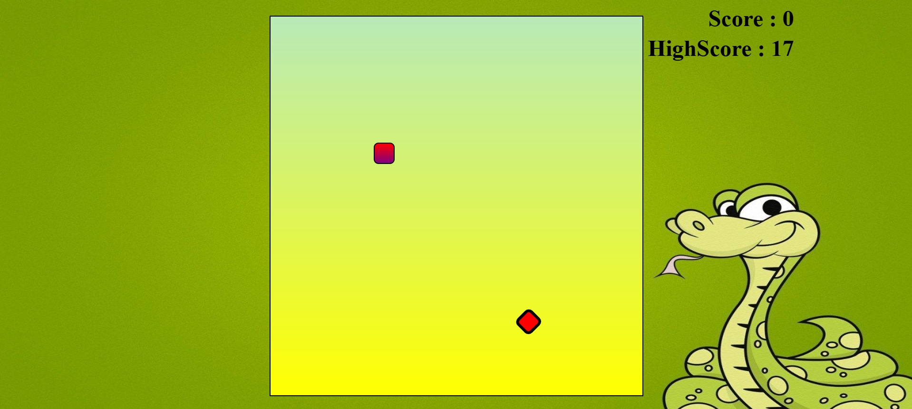

# The Snake Game

This is a beginner level projecct that is similar to the popular to the Snake Xenia game of the Nokia cellphones.

# Things I learned

1. Project structuring and development
2. Backend Vanilla JavaScript
3. Used git and github commands
4. Deployment of website using GitHub Pages

# How it looks :

As I learn further about other front-end and backend technologies , I would improve this gaming applications further.
